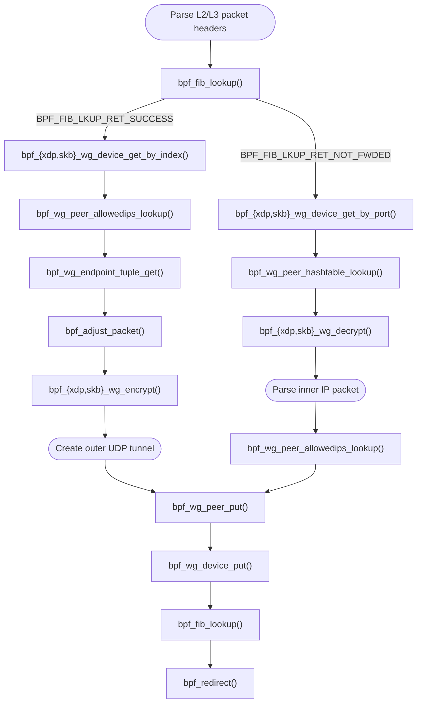

# WireGuard eBPF datapath

This repository contains experimental eBPF programs that implement a WireGuard
packet datapath for XDP and TC. The kernel program classifies packets with FIB
lookups, encrypts forwarded inner packets, decrypts local WireGuard data packets,
and redirects packets after rebuilding the L2/L3/L4 headers.

The tree also contains a small libbpf/libmnl userspace loader that configures
the BPF object, attaches it to interfaces, and optionally prepares cpumap-based
RSS programs.

## Layout

- `src/common.h`: constants and configuration shared by userspace and BPF code.
- `src/kernel/`: XDP/TC WireGuard BPF program and helper headers.
- `src/kernel/dsa/`: DSA-specific L2 parsing and transmit helpers.
- `src/kernel/rss/`: optional XDP programs that redirect packets through a CPU map.
- `src/user/`: libbpf/libmnl loader, argument parsing, logging, and OpenWrt build helper.
- `patches/`: kernel patches required by the BPF WireGuard/checksum helpers.

## Build

Build the BPF object files:

```sh
make -C src/kernel
```

This produces little-endian and big-endian objects in `src/kernel/obj/`.

Build the userspace loader:

```sh
make -C src/user
```

The userspace loader links against `libbpf` and `libmnl`, so the corresponding
development headers/libraries must be available in the host or target staging
environment.

For OpenWrt cross builds, pass the OpenWrt tree and target parameters expected by
`src/user/OpenWrt.mk`, for example:

```sh
make -C src/user OPENWRT=/path/to/openwrt ARCH=aarch64
```

## Usage

```sh
src/user/bin/host/bpfwg [options] <hook> <network_interface> [network_interface...]
```

Hooks:

- `tc`: attach the TC ingress program.
- `xdp`: attach XDP with automatic mode selection.
- `xdpgeneric`: attach generic/SKB XDP.
- `xdpnative`: attach native/driver XDP.
- `xdpoffload`: attach hardware-offloaded XDP.

Options:

- `-?`, `-h`, `--help`: print detailed help and exit.
- `-c`, `--conntrack`: require conntrack entries before redirecting packets.
- `-d`, `--dsa`: require DSA discovery. DSA is auto-detected when targets are DSA user ports or a DSA conduit.
- `-e`, `--exclude-cpus LIST`: exclude CPUs from RSS targets, e.g. `0,1,4-7`.
- `-l`, `--log-level LEVEL`: set `error`, `warning`, `info`, `debug`, or `verbose`.
- `-o`, `--object PATH`: select the BPF object to load.
- `-r`, `--rss PROGRAM`: enable cpumap RSS with an XDP RSS program.
- `-u`, `--udp`: disable IPv4 UDP tunnel checksum calculation.

Examples:

```sh
./bpfwg tc eth0 -o src/kernel/obj/wg_le.o
./bpfwg xdpnative eth0 eth1 -o src/kernel/obj/wg_le.o -r rx_hash -e 0
./bpfwg xdp lan1 -o src/kernel/obj/wg_le.o --conntrack --udp
```

The loader stays in the foreground and detaches the programs when it receives
`SIGINT` or `SIGTERM`.

## RSS Mode

RSS mode loads the main object with `xdp_wg_cpumap` as the cpumap program and
loads one device-bound RSS program per attached interface. The RSS programs share
`rss_cpu_map`; userspace populates the cpumap and writes the RSS indirection
table into the `.rodata.rss` config section before each object is loaded.

Available RSS programs in the current tree are:

- `round_robin`: distribute packets across allowed CPUs with a shared iterator.
- `match_port`: choose the target CPU from the L4 destination port.
- `tuple_steering`: keep flows stable by storing tuple-to-CPU assignments.
- `rx_hash`: use the device-provided RX hash metadata when available.

RSS requires an XDP hook. The loader rejects TC and generic XDP for RSS because
the device-bound RSS programs need device-backed XDP metadata support.

## Notes

- The TC program passes GSO/GRO-marked SKBs instead of rewriting them.
- The BPF object expects patched WireGuard/checksum kfuncs from `patches/`.
- The current DSA helper supports the MediaTek tag format `mtk`.

## eBPF Kernel API

The BPF program uses WireGuard kfuncs to acquire WireGuard device and peer
references, look up routing state inside WireGuard, and encrypt or decrypt packet
data in-place. The verifier tracks acquired references, so every successful
`wg_device` or `wg_peer` lookup must be released with the matching put helper
before the program exits.

The `__sz` suffix in kfunc parameter names is a verifier size annotation for
memory passed from the BPF program to the kernel.

### WireGuard Device Lookup

#### `struct wg_device *bpf_xdp_wg_device_get_by_index(struct xdp_md *xdp_ctx, __u32 ifindex)`<br>`struct wg_device *bpf_skb_wg_device_get_by_index(struct __sk_buff *skb_ctx, __u32 ifindex)`

- **Parameters:**
  - `xdp_ctx`/`skb_ctx`: XDP or TC program context.
  - `ifindex`: Network interface index.
- **Returns:** Pointer to a `wg_device` or `NULL` if not found.
- **Description:**  
  Acquire the WireGuard device for an interface index. The encrypt path uses this
  after `bpf_fib_lookup()` identifies the WireGuard output interface. Must be
  released before the program exits with
  [`bpf_wg_device_put`](#void-bpf_wg_device_putstruct-wg_device-wg).

#### `struct wg_device *bpf_xdp_wg_device_get_by_port(struct xdp_md *xdp_ctx, __u16 port)`<br>`struct wg_device *bpf_skb_wg_device_get_by_port(struct __sk_buff *skb_ctx, __u16 port)`

- **Parameters:**
  - `xdp_ctx`/`skb_ctx`: XDP or TC program context.
  - `port`: WireGuard UDP listen port.
- **Returns:** Pointer to a `wg_device` or `NULL` if not found.
- **Description:**  
  Acquire the WireGuard device bound to a UDP listen port. The decrypt path uses
  this for incoming WireGuard data packets. Must be released before the program
  exits with
  [`bpf_wg_device_put`](#void-bpf_wg_device_putstruct-wg_device-wg).

### Peer Lookup

#### `struct wg_peer *bpf_wg_peer_allowedips_lookup(struct wg_device *wg, const void *addr, __u32 addr__sz)`

- **Parameters:**
  - `wg`: WireGuard device reference.
  - `addr`: IPv4/IPv6 address pointer.
  - `addr__sz`: Size of the address, 4 for IPv4 or 16 for IPv6.
- **Returns:** Pointer to a `wg_peer` or `NULL` if not found.
- **Description:**  
  Look up the peer selected by WireGuard AllowedIPs for the supplied plaintext IP
  address. The encrypt path uses the inner destination address; the decrypt path
  uses the plaintext source address to validate that the packet belongs to the
  decrypted peer. Must be released before the program exits with
  [`bpf_wg_peer_put`](#void-bpf_wg_peer_putstruct-wg_peer-peer).

#### `struct wg_peer *bpf_wg_peer_hashtable_lookup(struct wg_device *wg, __le32 idx)`

- **Parameters:**
  - `wg`: WireGuard device reference.
  - `idx`: Receiver index from the incoming WireGuard data header.
- **Returns:** Pointer to a `wg_peer` or `NULL` if not found.
- **Description:**  
  Look up a peer from the receiver index in an incoming WireGuard data header.
  Must be released before the program exits with
  [`bpf_wg_peer_put`](#void-bpf_wg_peer_putstruct-wg_peer-peer).

### Endpoint Lookup

#### `int bpf_wg_endpoint_tuple_get(struct wg_peer *peer, struct bpf_sock_tuple *tuple, __u32 tuple__sz)`

- **Parameters:**
  - `peer`: WireGuard peer reference.
  - `tuple`: Output buffer for the current UDP endpoint tuple.
  - `tuple__sz`: Size of `tuple`.
- **Returns:** Address family, `AF_INET` or `AF_INET6`, on success; negative error code otherwise.
- **Description:**  
  Read the current UDP endpoint tuple for a peer. The encrypt path uses this
  tuple to build the outer UDP tunnel header.

### Encryption And Decryption

#### `int bpf_xdp_wg_encrypt(struct xdp_md *xdp_ctx, __u32 offset, __u32 length, struct wg_peer *peer)`<br>`int bpf_skb_wg_encrypt(struct __sk_buff *skb_ctx, __u32 offset, __u32 length, struct wg_peer *peer)`

- **Parameters:**
  - `xdp_ctx`/`skb_ctx`: XDP or TC program context.
  - `offset`: WireGuard header offset.
  - `length`: WireGuard message length.
  - `peer`: WireGuard peer reference.
- **Returns:** `0` on success, negative error code otherwise.
- **Description:**  
  Encrypt packet data in-place with the peer sending key. The BPF program
  prepares packet headroom/trailer space first, then passes the WireGuard header
  offset and WireGuard message length to the kfunc.

#### `int bpf_xdp_wg_decrypt(struct xdp_md *xdp_ctx, __u32 offset, __u32 length, struct wg_peer *peer)`<br>`int bpf_skb_wg_decrypt(struct __sk_buff *skb_ctx, __u32 offset, __u32 length, struct wg_peer *peer)`

- **Parameters:**
  - `xdp_ctx`/`skb_ctx`: XDP or TC program context.
  - `offset`: WireGuard header offset.
  - `length`: WireGuard message length.
  - `peer`: WireGuard peer reference.
- **Returns:** `0` on success, negative error code otherwise.
- **Description:**  
  Decrypt packet data in-place with the peer receiving key. The kfunc validates
  the Poly1305 tag and WireGuard receive counter before the BPF program parses
  the inner plaintext IP packet.

### Reference Release

#### `void bpf_wg_device_put(struct wg_device *wg)`

- **Parameters:**
  - `wg`: WireGuard device reference acquired by a device lookup helper.
- **Returns:** Nothing.
- **Description:**  
  Release a previously acquired WireGuard device reference.

#### `void bpf_wg_peer_put(struct wg_peer *peer)`

- **Parameters:**
  - `peer`: WireGuard peer reference acquired by a peer lookup helper.
- **Returns:** Nothing.
- **Description:**  
  Release a previously acquired WireGuard peer reference.

## Program Flow

The following flow chart shows how the BPF program uses the WireGuard kfuncs to
encrypt or decrypt packets:


