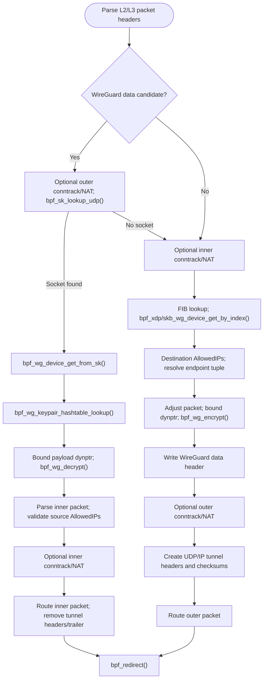

# WireGuard eBPF datapath

This repository contains experimental eBPF programs that implement a WireGuard
packet datapath for XDP and TC. The kernel program classifies packets with FIB
lookups, encrypts forwarded inner packets, decrypts local WireGuard data packets,
and redirects packets after rebuilding the L2/L3/L4 headers.

The tree also contains a small libbpf/libmnl userspace loader that configures
the BPF object, attaches it to interfaces, and optionally prepares cpumap-based
RSS programs.

## Layout

- `src/common.h`: constants and configuration shared by userspace and BPF code.
- `src/kernel/`: XDP/TC WireGuard BPF program and helper headers.
- `src/kernel/dsa/`: DSA-specific L2 parsing and transmit helpers.
- `src/kernel/rss/`: optional XDP programs that redirect packets through a CPU map.
- `src/user/`: libbpf/libmnl loader, argument parsing, logging, and OpenWrt build helper.
- `patches/`: kernel patches required by the BPF WireGuard/checksum helpers.

## Build

Build the BPF object files:

```sh
make -C src/kernel
```

This produces little-endian and big-endian objects in `src/kernel/obj/`.

Build the userspace loader:

```sh
make -C src/user
```

The BPF build requires Clang with the BPF target and GNU C23 support, plus the
Linux and libbpf headers. The userspace loader links against `libbpf`, `libelf`,
`zlib`, and `libmnl`, so their development headers/libraries must be available in
the host or target staging environment. Use a libbpf version that supports TCX
(`bpf_program__attach_tcx()`) and a kernel with TCX ingress support.

The WireGuard datapath requires the kernel patches in `patches/`, applied in
numeric order to a compatible kernel tree and built with WireGuard and BPF
support:

1. `0001`: dynptr-based checksums for XDP and SKB packet data.
2. `0002`: dynptr helper visibility and size export for kernel modules.
3. `0003`: dynptr-to-scatterlist conversion for packet cryptography.
4. `0004`: WireGuard device, peer, keypair, endpoint, and crypto kfuncs.
5. `0005`: explicit WireGuard traffic/error accounting kfuncs and atomic peer
   byte counters.

Conntrack mode additionally requires the kernel's BPF conntrack lookup and
timeout-change kfuncs, and readable conntrack timeout sysctls.

For OpenWrt cross builds, pass the OpenWrt tree and target parameters expected by
`src/user/OpenWrt.mk`, for example:

```sh
make -C src/user OPENWRT=/path/to/openwrt ARCH=aarch64
```

## Usage

```sh
src/user/bin/host/bpfwg [options] <hook> <network_interface> [network_interface...]
```

Hooks:

- `tc`: attach the TC ingress program through a TCX BPF link.
- `xdp`: attach XDP with automatic mode selection.
- `xdpgeneric`: attach generic/SKB XDP.
- `xdpnative`: attach native/driver XDP.
- `xdpoffload`: attach hardware-offloaded XDP.

Options:

- `-?`, `-h`, `--help`: print detailed help and exit.
- `-c`, `--conntrack`: require eligible conntrack entries, refresh their timeouts, and apply existing NAT mappings.
- `-d`, `--dsa`: require DSA discovery. DSA is auto-detected when targets are DSA user ports or a DSA conduit.
- `-e`, `--exclude-cpus LIST`: exclude CPUs from RSS targets, e.g. `0,1,4-7`.
- `-l`, `--log-level LEVEL`: set `error`, `warning`, `info`, `debug`, or `verbose`.
- `-o`, `--object PATH`: select the BPF object to load.
- `-r`, `--rss PROGRAM`: enable cpumap RSS with an XDP RSS program.
- `-R`, `--rss-only PROGRAM`: steer packets through the CPU map to the network stack without running the WireGuard cpumap program.
- `-u`, `--udp`: disable IPv4 UDP tunnel checksum calculation.

Examples:

```sh
src/user/bin/host/bpfwg tc eth0 -o src/kernel/obj/wg_le.o
src/user/bin/host/bpfwg xdpnative eth0 eth1 -o src/kernel/obj/wg_le.o -r rx_hash -e 0
src/user/bin/host/bpfwg xdp lan1 -o src/kernel/obj/wg_le.o --conntrack --udp
```

The loader stays in the foreground and detaches the programs when it receives
`SIGINT` or `SIGTERM`. TCX links are destroyed on detach, leaving other TC
attachments in place.

## RSS Mode

RSS mode loads the main object with `xdp_wg_cpumap` as the cpumap program and
loads one device-bound RSS program per attached interface. The RSS programs share
`rss_cpu_map`; userspace populates the cpumap and writes the RSS indirection
table into the `.rodata.rss` config section before each object is loaded.

Available RSS programs in the current tree are:

- `round_robin`: distribute packets across allowed CPUs with a shared iterator.
- `match_port`: choose the target CPU from the L4 destination port.
- `tuple_steering`: keep flows stable by storing tuple-to-CPU assignments.
- `rx_hash`: use the device-provided RX hash metadata when available.

RSS requires an XDP hook. The loader rejects TC and generic XDP for RSS because
the device-bound RSS programs need device-backed XDP metadata support.

With `--rss-only`, the CPU map passes packets directly to the network stack
instead of running `xdp_wg_cpumap`.

## Conntrack Mode

With `--conntrack`, both the inner TCP/UDP flow and the outer UDP tunnel must
have eligible conntrack entries. Existing offloaded entries are accepted;
otherwise entries must be confirmed, TCP must be established and assured, and
entries with helpers, sequence adjustment, or NAT clashes fall back to the
network stack. TCP SYN, FIN, and RST packets also use the network stack.

The datapath applies existing source/destination NAT mappings in either flow
direction. Inner packet rewrites update IP and transport checksums; outer tuple
rewrites happen before creating the outgoing UDP tunnel headers or looking up
the incoming WireGuard socket. Connection setup and NAT mapping creation remain
with the network stack.

At startup, the loader reads
`/proc/sys/net/netfilter/nf_conntrack_tcp_timeout_established` and
`/proc/sys/net/netfilter/nf_conntrack_udp_timeout_stream`, converts their values
from seconds to milliseconds, and writes them into `.rodata.ct`. The datapath
uses these values when refreshing entries. Startup fails if either value cannot
be read; restart the loader to pick up later sysctl changes.

## Notes

- The TC program passes GSO/GRO-marked SKBs instead of rewriting them.
- IPv4 fragments and packets with IPv4 options use the network stack.
- The BPF object expects patched WireGuard/checksum kfuncs from `patches/`.
- The current DSA helper supports the MediaTek tag format `mtk`.

## eBPF Kernel API

The BPF program uses WireGuard kfuncs to acquire devices, peers, and receiving
keypairs, resolve endpoints, and encrypt or decrypt packet data in-place. The
verifier tracks acquired references: every successful device, AllowedIPs peer,
or keypair lookup must be released with its matching put helper before exit.
The `__sz` suffix is a verifier size annotation for memory passed to a kfunc.

### Device Lookup

```c
struct wg_device *bpf_xdp_wg_device_get_by_index(
    struct xdp_md *xdp_ctx, __u32 ifindex, __s32 netns_id, int *err);
struct wg_device *bpf_skb_wg_device_get_by_index(
    struct __sk_buff *skb_ctx, __u32 ifindex, __s32 netns_id, int *err);
struct wg_device *bpf_wg_device_get_from_sk(struct sock *sock);
```

Index lookup acquires the WireGuard device selected by the FIB output interface.
`netns_id` selects a network namespace; the datapath uses `BPF_F_CURRENT_NETNS`.
Failure returns `NULL` and writes a negative error to `err`.

Incoming packets use `bpf_sk_lookup_udp()` on the outer tuple, then
`bpf_wg_device_get_from_sk()` to acquire the WireGuard device associated with the
socket. A socket that does not belong to WireGuard returns `NULL`. Release the
socket separately with `bpf_sk_release()` and the device with
`bpf_wg_device_put()`.

### Peer, Keypair, And Endpoint Lookup

```c
struct wg_peer *bpf_wg_peer_allowedips_lookup(
    struct wg_device *wg, const void *addr, __u32 addr__sz);
struct noise_keypair *bpf_wg_keypair_hashtable_lookup(
    struct wg_device *wg, __le32 key_idx, unsigned long *peer);
int bpf_wg_endpoint_tuple_get(
    struct wg_peer *peer, struct bpf_sock_tuple *tuple);
```

AllowedIPs lookup acquires a peer for an IPv4 (4-byte) or IPv6 (16-byte) address,
returning `NULL` if no live peer matches. Encryption uses the inner destination;
decryption checks that the inner source maps to the authenticated peer. Release
this reference with `bpf_wg_peer_put()`.

Keypair lookup uses the incoming WireGuard receiver index and acquires a
receiving keypair, or returns `NULL`. The `peer` output contains the parent
peer's address for comparison with the AllowedIPs result; it is not a separate
BPF peer reference. Release the keypair with `bpf_wg_keypair_put()`.

Endpoint lookup fills the peer's outer UDP socket tuple and returns `AF_INET`
or `AF_INET6`, or a negative error. The tuple size is implied by the address
family; the API has no tuple-size argument.

### Encryption, Decryption, And Checksums

```c
long bpf_wg_encrypt(struct bpf_dynptr *ptr, struct wg_peer *peer,
                    __u64 *counter);
long bpf_wg_decrypt(struct bpf_dynptr *ptr, struct noise_keypair *keypair,
                    __u64 counter);
__s64 bpf_dynptr_checksum(const struct bpf_dynptr *ptr, __u32 csum);
```

Create an XDP or SKB dynptr and bound it with `bpf_dynptr_adjust()`. Crypto bounds
start after the WireGuard data header and include the payload, padding, and
Poly1305 tag space. Encryption prepares headroom and trailer space first, then
returns the remote receiver index as a nonnegative value and writes the nonce to
`counter`. The BPF program writes these values into the WireGuard header.

Decryption takes the nonce from the WireGuard header, validates authentication
and the replay counter, and returns `0` on success. Crypto failures return a
negative error, including `-EKEYEXPIRED` for expired session keys. The datapath
then parses the plaintext and checks AllowedIPs before forwarding it.

The checksum kfunc processes the bounded XDP/SKB dynptr and returns the partial
checksum accumulated with `csum`, or a negative error. It is used to construct
outgoing UDP tunnel checksums.

### Explicit Traffic Accounting

Patch `0005` exposes these additional kfuncs:

```c
int bpf_wg_peer_update_rx_stats(struct noise_keypair *keypair, __u32 message_len);
int bpf_wg_peer_update_tx_stats(struct wg_peer *peer, __u32 message_len);
```

`message_len` includes the WireGuard data header, padding, and authentication
tag, and excludes UDP/IP headers. RX accounting updates peer received bytes
after authentication, replay validation, inner-packet validation, and AllowedIPs
checks. TX accounting updates peer transmitted bytes for messages prepared
for transmission. Lengths of 32 bytes or less, including empty-payload
keepalives, return `-EINVAL` without changing counters, matching the crypto
kfuncs' rejection of empty payloads.

These calls do not consume references and must avoid double-counting packets
handled by native WireGuard. BPF traffic does not update WireGuard device
packet, byte, error, or drop counters.

The datapath calls RX accounting after validating the authenticated inner
packet and its source AllowedIPs, using the original message length before
padding/tag removal. TX accounting runs after successful encryption and
WireGuard data header construction, before releasing the peer reference.
It includes messages later passed to the stack or dropped during UDP/IP
header construction or output processing, and does not confirm delivery.

### Reference Release

```c
void bpf_wg_device_put(struct wg_device *wg);
void bpf_wg_peer_put(struct wg_peer *peer);
void bpf_wg_keypair_put(struct noise_keypair *keypair);
```

Each helper releases the corresponding acquired reference.

## Program Flow



The diagram shows the successful paths. Lookup failures and unsupported packets
fall back to the network stack or are dropped as appropriate. Acquired socket,
device, peer, and keypair references are released on their respective exit paths.
